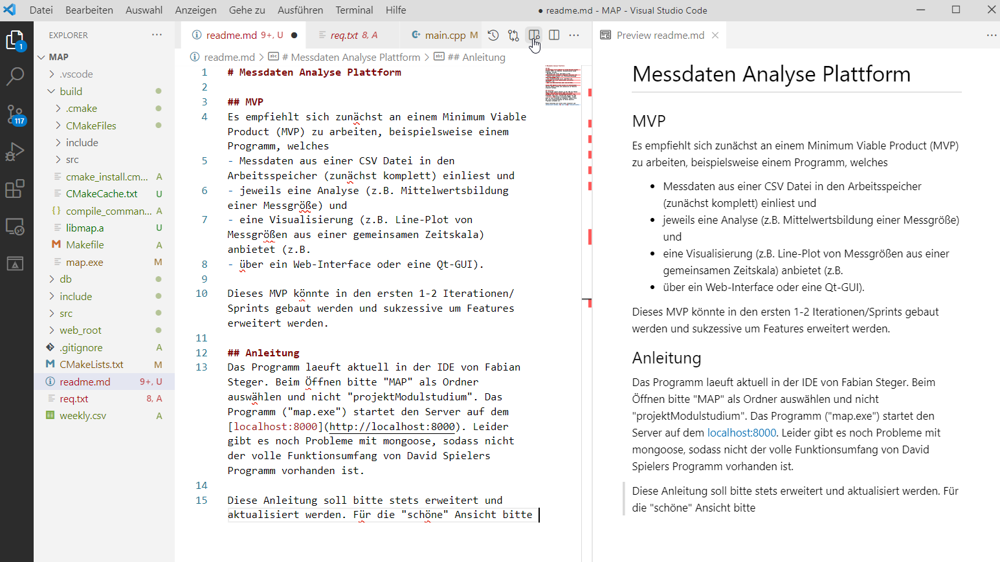
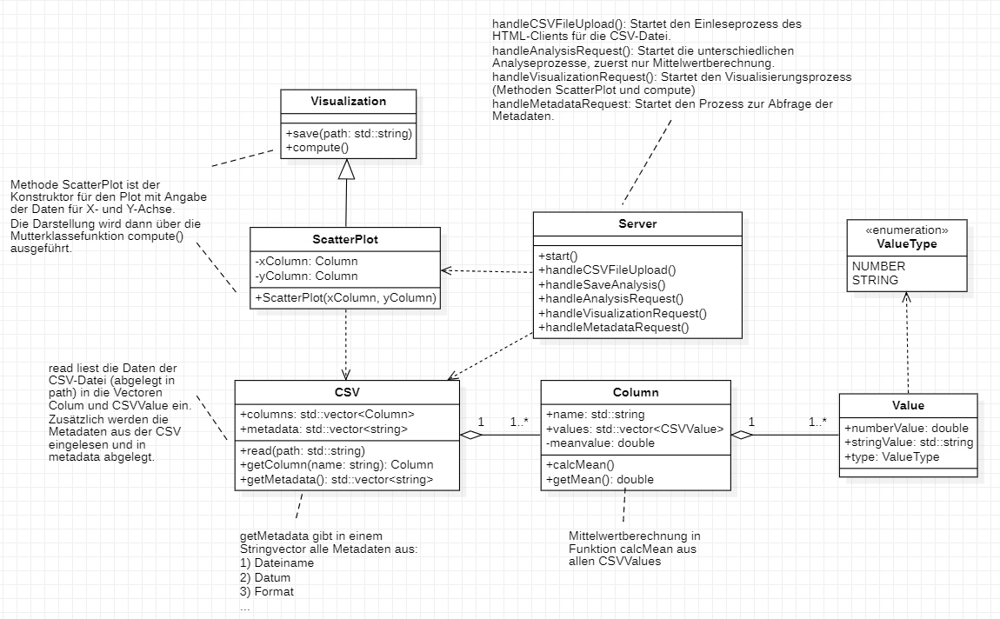

# Messdaten Analyse Plattform

## MVP
Es empfiehlt sich zunaechst an einem Minimum Viable Product (MVP) zu arbeiten, beispielsweise einem Programm, welches 
- Messdaten aus einer CSV Datei in den Arbeitsspeicher (zunaechst komplett) einliest und 
- jeweils eine Analyse (z.B. Mittelwertsbildung einer Messgroesse) und 
- eine Visualisierung (z.B. Line-Plot von Messgroessen aus einer gemeinsamen Zeitskala) anbietet (z.B. 
- ueber ein Web-Interface oder eine Qt-GUI).  

Dieses MVP koennte in den ersten 1-2 Iterationen/Sprints gebaut werden und sukzessive um Features erweitert werden. 

## Anleitung
Das Programm laeuft aktuell in der IDE von Fabian Steger. Beim oeffnen bitte "MAP" als Ordner auswaehlen und nicht "projektModulstudium". Das Programm ("map.exe") muss vom "build"-Ordner aus gestartet werden (Standard, wenn man neu "builded"):
```
PS ...\build> ."C:/cpp_ide/timestamp_extractor/build/timestamp_extractor.exe"
```
Nach Ausfuehrung des Programms startet den Server auf dem [localhost:8000](http://localhost:8000).

Diese Anleitung soll bitte stets erweitert und aktualisiert werden. Fuer die Preview bitte "Open Preview to the Side" klicken:
<p align="center">
    
</p>

## Klassendiagramm MVP
<p align="center">
    
</p>

## Quellen