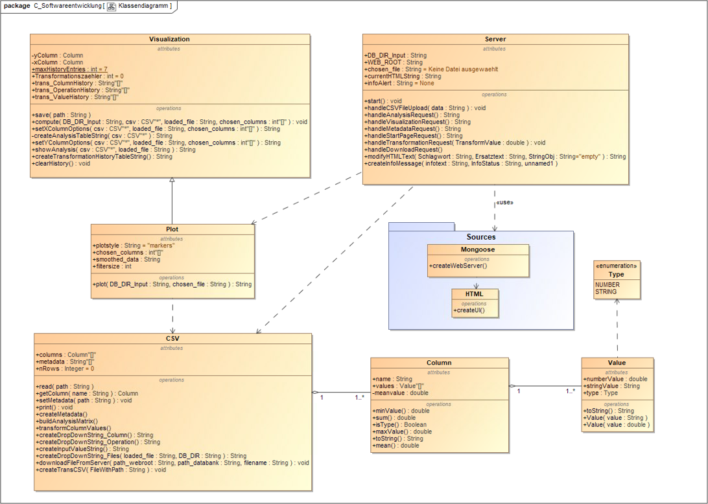

# Messdaten Analyse Plattform (MAP)

## Aufgabenstellung

- Entwicklung einer Analyseplattform für Messdaten
- Zeitreihendaten physikalischer Größen als Messdaten
- Einlesen der Daten aus verschiedenen Quellen durch einen zentralen Server
- Ausfallsichere Datenbank
- Suche und Analyse der Daten innerhalb der Datenbank
- Benutzerschnittstelle durch einen Client
- Client stellt Such- und Analysefunktion mit Visualisierung zur Verfügung
 

## Anleitung

Das Programm läuft in der IDE von Fabian Steger. Der "build"-Ordner befindet sich im Ordner MAP, sodass "MAP" als Ordner in Visual Studio Code ausgewählt werden muss. Das Programm ("map.exe") muss vom "build"-Ordner aus gestartet werden (Standard, wenn man neu "builded"):
```
.../projektModulstudium/MAP/build> .\map.exe
```
Nach Ausfuehrung des Programms startet den Server auf dem [localhost:8000](http://localhost:8000).


## Anwendung

Durch Aufrufen des [localhost:8000](http://localhost:8000) kann die Anwendung genutzt werden. Hochgeladene Datensätze werden in der Datenbank abgelegt. Dort liegt auch bereits eine Test-Datei und die zugehörige Meta-Datei, die beim Hochladen automatisch mitangelegt wird:
```
.../projektModulstudium/MAP/db/test.csv
.../projektModulstudium/MAP/db/test.csvmeta
```
Das sind die Funktionen, die von der Startseite aus aufgerufen werden können:
<p align="left">
    
</p>

| Bereich                             | Beschreibung                                                       |
| ----------------------------------- | ------------------------------------------------------------------ |
| Messdaten hochladen                 | Messdatei für Upload auswählen und hochladen                       |
| Messdatei aus Serverdatenbak wählen | Bereits vorhandene Daten auswählen und ggf. herunterladen          |
| Messdatei transformieren            | Rechenoperationen auf einzelne Spalten ausführen                   |
| Transformationshistorie             | Die Historie der angewandten Operationen wird hier angezeigt       |
| Messdatei analysieren               | Zur Analyse können hier ein Diagramm und ein Report erzeugt werden |
|                                     |                                                                    |


## Klassendiagramm

Das Klassendiagramm zeigt die Klassen, Schnittstellen sowie deren Beziehungen:
<p align="center">
    
</p>


## Unit-Tests

Zur Ausführung der Unit-Tests muss die CMakeLists.txt angepasst werden:
```
set(SOURCES
    ...
    #src/main.cpp
    ...
    test/utest.cpp
)
INCLUDE_DIRECTORIES(*Pfad zu boost_1_79_0 anpassen*)
```