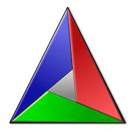
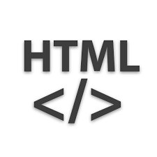
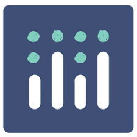

# Projekt im Modulstudium "Grundlagen Softwareentwicklung"

## Rahmenbedingungen 

Im Rahmen des Modulstudiums ist eine gemeinsame Projektarbeit zu den Inhalten der Module Programmierung, Rechner- und Betriebssysteme, Software-Engineering und Requirements-Engineering & SW-Tests durchzuführen. Es werden die Ergebnisse der Gruppenarbeit (als Gruppe) als auch die finale Präsentation (individuell) bewertet und gehen in die Gesamtwertung des Moduls ein. 

## Lernergebnisse

Nach der Teilnahme an den Modulveranstaltungen sind die Teilnehmer in der Lage,
- ein Projekt zur verstärkten Nutzung von Software im eigenen Aufgabenbereich zu realisieren,
- das Gelernte in konkreten weiteren SW-Projekten des eigenen Aufgabenbereichs umzusetzen.

## Aufgabenstellung 

Es soll eine Analyseplattform für Messdaten entwickelt werden. Dafür können Messdaten (Zeitreihendaten physikalischer Größen) von verschiedenen Quellen (Hardwareanbindungen wie Datenlogger, Sensoren oder Mikrocontroller als auch Dateien) auf Nutzerwunsch durch einen zentralen Server eingelesen werden. Die Daten werden dabei ausfallsicher mit Hilfe einer Datenbankanbindung abgelegt und können dort durchsucht als auch analysiert werden. Die Benutzerschnittstelle erfolgt mit Hilfe eines Clients, welcher die Such- als auch Analysefunktion mit Visualisierungen zur Verfügung stellt. 

## Installation

Die `Analyseplattform` kann einfach über [github](https://github.com/xivpaul/projektModulstudium) bezogen werden. Um das Repository lokal zu klonen kann der folgende Befehl ausgeführt werden:

```shell
git clone https://github.com/xivpaul/projektModulstudium.git
```

Das Programm "Messdaten Analyse Plattform" muss vom Ordner "MAP" aus in Visual Studio Code gestartet werden. Alle Details befinden sich in der zugehörigen Readme-Datei:
```
MAP/readme.md
```

## Verwendete Programmiersprachen und Tools

*  C++
*  C++ Compiler MinGW-w64 
*  Cameo Systems Modeler
*  CMake
*  git
*  Git Extensions
*  Hypertext Markup Language
*  plotly
*  Test Library boost
*  TESTONA light
*  Visual Studio Code


